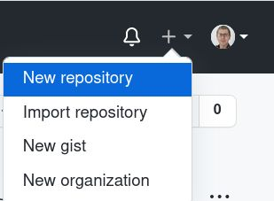
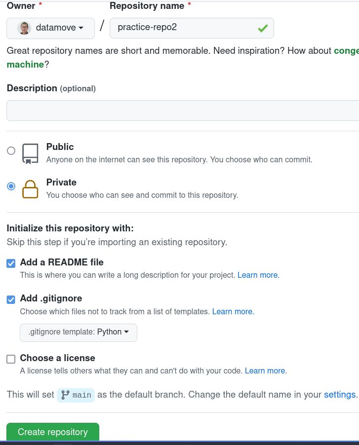
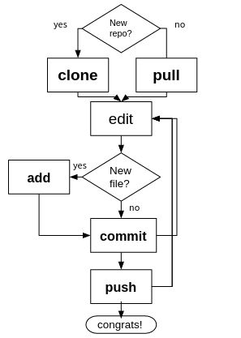
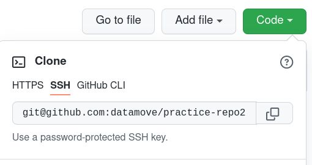

# Git. Начало работы

## С высоты птичьего полета

* Работа локальными репозиториями 
* Создаем репо на сайте Github
* Клонируем репо под персональным аккаунтом на сервере
* Добавляем файл, commit, push
* практикуемся разрешать конфликты

## Создаем репозиторий



Назначаем свойства. Файл .gitignore для Python позволяет отфильтровать ненужные в репо файлы, типа `__python__`.



## Общая схема работы

Для простого случая.



## Клонируем репозиторий

Адрес берем из вкладки SSH:



```bash
artem@artem-hp2:~$ git clone git@github.com:datamove/practice-repo.git
Cloning into 'practice-repo2'...
remote: Enumerating objects: 4, done.
remote: Counting objects: 100% (4/4), done.
remote: Compressing objects: 100% (3/3), done.
remote: Total 4 (delta 0), reused 0 (delta 0), pack-reused 0
Receiving objects: 100% (4/4), done.

artem@artem-hp2:~$ cd practice-repo
```

## Вносим изменения

### Создаем новый файл
Запустите редактор и напишите короткую программу на питоне, которая выводит `Hello git`.

`echo 'print("Hello git")' > hello.py`

### Добавляем в репо (git add)
`artem@artem-hp2:~/practice-repo2$ git add hello.py`

### Фиксируем изменения (git commit)

Перед тем, как сделать первый коммит, сделайте начальный конфиг-файл для git.

Создайте файл `~/.gitconfig` со следующим содержимым:

```
[user]
 email = ваш имейл используемый на гитхабе
 name = ваше имя
```
Github используем ваш имейл для идентификации коммитов.

Теперь проверим картину в целом:

```bash
artem@artem-hp2:~/practice-repo2$ git status
```


Теперь можно делать коммит.

```bash
artem@artem-hp2:~/practice-repo2$ git commit -a -m "hello git programm"
[main f3643ec] hello git programm
 1 file changed, 1 insertion(+)
 create mode 100644 hello.py
```

### Синхронизируем с github (push)
```
artem@artem-hp2:~/practice-repo2$ git push
Enumerating objects: 4, done.
Counting objects: 100% (4/4), done.
Delta compression using up to 12 threads
Compressing objects: 100% (2/2), done.
Writing objects: 100% (3/3), 328 bytes | 328.00 KiB/s, done.
Total 3 (delta 0), reused 0 (delta 0)
To github.com:datamove/practice-repo2.git
   5f1d7af..f3643ec  main -> main
```

### Смотрим историю коммитов

```bash
artem@artem-hp2:~/practice-repo2$ git log
commit f3643ec76a8dbf971545a201b73fec9e40f2a67a (HEAD -> main, origin/main, origin/HEAD)
Author: Artem <datamove@gmail.com>
Date:   Fri Oct 22 22:56:21 2021 +0300

    hello git programm

commit 5f1d7af5c0d809844cfd039809d1fda64fb1ba5c
Author: Artem Trunov <datamove@gmail.com>
Date:   Thu Oct 21 22:44:41 2021 +0300

    Initial commit
```
