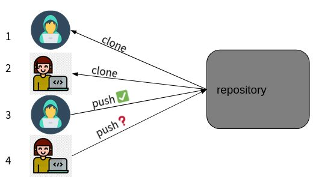
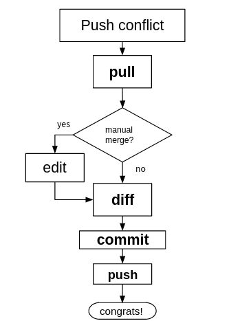
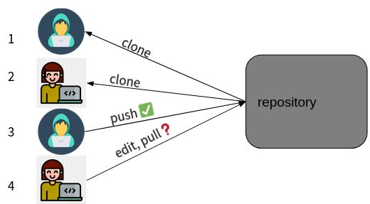
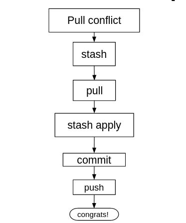

# Git. Конфликты слияния

## Эмулируем конфликты

### Конфликт на стадии push
Посмотрим, что будет, если запушить в гитхаб локальные изменения при наличии в гитхабе изменения, которые сделал кто-то ещё.



#### Меняем файл на Github

Зайдите на страничку этого вашего репо на github.com и и отредактируйте `hello.py` - поменяйте строку вывода, например на `Hello git2`. Это вы сами сделали, но мы эмулируем работу в команде, и представим как будто это ваш коллега сделал.

#### Меняем файл в репо на сервере

Теперь представим, что мы не знаем об этом изменении коллеги и продолжаем нашу работу.

Отредактируйте файл, чтоб приветствие было `Hello git3`.

Далее, как обычно:

```bash
artem@artem-hp2:~/practice-repo2$ vi hello.py 

artem@artem-hp2:~/practice-repo2$ git commit -m "change to git3" hello.py 
[main 094dc35] change to git3
 1 file changed, 1 insertion(+), 1 deletion(-)
 
artem@artem-hp2:~/practice-repo2$ git push
To github.com:datamove/practice-repo2.git
 ! [rejected]        main -> main (fetch first)
error: failed to push some refs to 'git@github.com:datamove/practice-repo2.git'
hint: Updates were rejected because the remote contains work that you do                                                  
hint: not have locally. This is usually caused by another repository pushing
hint: to the same ref. You may want to first integrate the remote changes
hint: (e.g., 'git pull ...') before pushing again.
hint: See the 'Note about fast-forwards' in 'git push --help' for details.
```

Мы получили ошибку - git не может принять ваши изменения в этотй файл, так как на github есть другие изменения, сделанные "кем-то еще". 

#### Разрешаем конфликт

Общая схема разрешения конфликта на стадии push:



Делать нечего, надо интергрировать изменения. Git посоветовал сделать `pull`, выполняем:

```bash
artem@artem-hp2:~/practice-repo2$ git pull
remote: Enumerating objects: 5, done.
remote: Counting objects: 100% (5/5), done.
remote: Compressing objects: 100% (2/2), done.
remote: Total 3 (delta 1), reused 0 (delta 0), pack-reused 0
Unpacking objects: 100% (3/3), 642 bytes | 642.00 KiB/s, done.
From github.com:datamove/practice-repo2
   ba55fbd..2dccff9  main       -> origin/main
Auto-merging hello.py
CONFLICT (content): Merge conflict in hello.py
Automatic merge failed; fix conflicts and then commit the result.
```

git не может слить сам изменения сделанные на сайте и ваши изменения в репо на сервере, потому что они в одной и той же строчке. Вы должны сами это сделать ручками. Смотрим, что в файле.

```bash
artem@artem-hp2:~/practice-repo2$ cat hello.py 
<<<<<<< HEAD
print("Hello  git3")
=======
print("Hello git2")
>>>>>>> 2dccff9e519d7c1d7f69a4da2c4ddd469d476600
```

По сути, это то же, что выдает команда `git diff`:

```bash
artem@artem-hp2:~/practice-repo2$ git diff hello.py
diff --cc hello.py
index fc9439d,be41f13..0000000
--- a/hello.py
+++ b/hello.py
@@@ -1,1 -1,1 +1,5 @@@
++<<<<<<< HEAD
 +print("Hello  git3")
++=======
+ print("Hello git2")
++>>>>>>> 2dccff9e519d7c1d7f69a4da2c4ddd469d476600
```

Откройте `hello.py` в редакторе и приведите в тот вид, что вам надо. Например, оставьте те изменения, что вы сами сделали на сервере. Тогда diff покажет отсутствие разницы (он показывает разницу между файлом в текущем состоянии и файлом на последний коммит).

```bash
artem@artem-hp2:~/practice-repo2$ git diff hello.py
diff --cc hello.py
index fc9439d,be41f13..0000000
--- a/hello.py
+++ b/hello.py
```
Казалось бы - все нормально? можно продолжать работу? Нет, смотрим статус:

```bash
artem@artem-hp2:~/practice-repo2$ git status
On branch main
Your branch and 'origin/main' have diverged,
and have 1 and 1 different commits each, respectively.
  (use "git pull" to merge the remote branch into yours)

You have unmerged paths.
  (fix conflicts and run "git commit")
  (use "git merge --abort" to abort the merge)

Unmerged paths:
  (use "git add <file>..." to mark resolution)
        both modified:   hello.py

no changes added to commit (use "git add" and/or "git commit -a")
```

Нам надо зафиксировать изменения после разрешения конфликта. Но прежде смотрим историю коммитов:

```bash
artem@artem-hp2:~/practice-repo2$ git log
commit 094dc35b46266192fda7e463de04c5cc6ecf73a8 (HEAD -> main)
Author: Artem <datamove@gmail.com>
Date:   Fri Oct 22 23:51:25 2021 +0300

    change to git3

commit ba55fbdea4f7a09356acc4b446335d216754d407
Author: Artem <datamove@gmail.com>
Date:   Fri Oct 22 23:49:47 2021 +0300

    change to git2

commit f3643ec76a8dbf971545a201b73fec9e40f2a67a
Author: Artem <datamove@gmail.com>
Date:   Fri Oct 22 22:56:21 2021 +0300

    hello git programm

commit 5f1d7af5c0d809844cfd039809d1fda64fb1ba5c
Author: Artem Trunov <datamove@gmail.com>
Date:   Thu Oct 21 22:44:41 2021 +0300

    Initial commit
```

Видим, что она теперь включает коммит, сделанный на сайте. Мы импортировали его во время последнего `git pull`.

Теперь снова надо сделать коммит - зафиксировать разрешение конфликта:

```bash
artem@artem-hp2:~/practice-repo2$ git commit -a -m "change to git3 after conflict"
[main d29ce9d] change to git3 after conflict
```

Внимание! Этот коммит надо делать с опцией `-a`, так как иначе выйдет ошибка:

```bash
artem@artem-hp2:~/practice-repo2$ git commit -m "change to git3 after conflict" hello.py 
fatal: cannot do a partial commit during a merge.
```

Это означает что коммит после конфликтного слияния делается на все измененные файлы, дабы избежать дальнейших конфликтов.

Наконец, делаем push, наэтот раз все успешно:

```bash
artem@artem-hp2:~/practice-repo2$ git push
Enumerating objects: 8, done.
Counting objects: 100% (8/8), done.
Delta compression using up to 12 threads
Compressing objects: 100% (3/3), done.
Writing objects: 100% (4/4), 383 bytes | 383.00 KiB/s, done.
Total 4 (delta 2), reused 0 (delta 0)
remote: Resolving deltas: 100% (2/2), completed with 1 local object.
To github.com:datamove/practice-repo2.git
   2dccff9..d29ce9d  main -> main
```

Зайдите на страничку сайта и убедитесь, что файл hello.py содержит изменения, сделанные на сервере.

###  Конфликт на стадии pull

Посмотрим, что будет, если скачать с гитхаба изменения при наличии в локальном репо ваших еще незакомиченых изменений.



#### Меняем файл на Github

Зайдите снова на страничку вашего репо и снова внесите изменения в hello.py, например `Hello git4`.

#### Меняем файл в репо на сервере

На сервере, откройте `hello.py` в редакторе и замените на `Hello git5`:

```bash
artem@artem-hp2:~/practice-repo2$ vi hello.py 
artem@artem-hp2:~/practice-repo2$ git diff
diff --git a/hello.py b/hello.py
index fc9439d..215071d 100644
--- a/hello.py
+++ b/hello.py
@@ -1 +1 @@
-print("Hello  git3")
+print("Hello  git5")
```
#### git pull

Теперь вы стали осмотрительнее, и не комитите ваш код, не сделав синхронизацию сначала:

```bash
artem@artem-hp2:~/practice-repo2$ git pull
remote: Enumerating objects: 5, done.
remote: Counting objects: 100% (5/5), done.
remote: Compressing objects: 100% (2/2), done.
remote: Total 3 (delta 1), reused 0 (delta 0), pack-reused 0
Unpacking objects: 100% (3/3), 640 bytes | 640.00 KiB/s, done.
From github.com:datamove/practice-repo2
   d29ce9d..faf40d3  main       -> origin/main
Updating d29ce9d..faf40d3
error: Your local changes to the following files would be overwritten by merge:
        hello.py
Please commit your changes or stash them before you merge.
Aborting
```
Но это все равно не работает - изменения-то на github.com есть, и есть у вас на сервере, поэтому синхронизация не работает.

Git предлагает сделать commit - тогда вы вернетесь к предыдущему сценарию, либо stash. Мы сейчас обсудим именно этот путь.

#### git stash

Stash - это спрятать зменения, сделанные в репо после последнего коммита в некий "карман". Тогда pull сработает и принесет изменения с сайта github к вам на диск. А потом вернем их назад.

Общая схема разрешения конфликта на стадии push:



Делать нечего, надо интергрировать изменения. Git посоветовал сделать `stash`, выполняем:

```bash
artem@artem-hp2:~/practice-repo2$ git stash
Saved working directory and index state WIP on main: d29ce9d change to git3 after conflict
artem@artem-hp2:~/practice-repo2$ git status
On branch main
Your branch is behind 'origin/main' by 1 commit, and can be fast-forwarded.
  (use "git pull" to update your local branch)

nothing to commit, working tree clean
artem@artem-hp2:~/practice-repo2$ cat hello.py 
print("Hello  git3")
```

Эта команда "очистила" репо от всех ваших изменений, что подтверждается командами status и самим файлом, содержимое которого "откатилось" назад к последнему коммиту. А все изменения - в "кармане":

```bash
artem@artem-hp2:~/practice-repo2$ git stash list
stash@{0}: WIP on main: d29ce9d change to git3 after conflict
```

#### pull после stash

Теперь делаем синхронизацию с репо на сайте github:

```bash
artem@artem-hp2:~/practice-repo2$ git pull
Updating d29ce9d..faf40d3
Fast-forward
 hello.py | 2 +-
 1 file changed, 1 insertion(+), 1 deletion(-)
artem@artem-hp2:~/practice-repo2$ cat hello.py 
print("Hello  git4")
```

Pull ожидаемо принес изменения с сайта github - они были сделаны поверх вашего последнего коммита и накатились без проблем.

#### stash apply

Вынимаем из кармана:

```bash
artem@artem-hp2:~/practice-repo2$ git stash apply
Auto-merging hello.py
CONFLICT (content): Merge conflict in hello.py
```

Да. опять конфликт - гит не может автоматически слить изменения в той же стройке. И его придется разрешать так же, как и в первый раз:

```bash
artem@artem-hp2:~/practice-repo2$ git diff
diff --cc hello.py
index 645a954,215071d..0000000
--- a/hello.py
+++ b/hello.py
@@@ -1,1 -1,1 +1,5 @@@
++<<<<<<< Updated upstream
 +print("Hello  git4")
++=======
+ print("Hello  git5")
++>>>>>>> Stashed changes
artem@artem-hp2:~/practice-repo2$ cat hello.py 
<<<<<<< Updated upstream
print("Hello  git4")
=======
print("Hello  git5")
>>>>>>> Stashed changes
```

#### разрешаем конфликт

Открываем в редакторе, делаем нужные изменения. Давайте теперь откажемся от наших изменений, и оставим "4".

```bash
artem@artem-hp2:~/practice-repo2$ vi hello.py 
artem@artem-hp2:~/practice-repo2$ git status
On branch main
Your branch is up to date with 'origin/main'.

Unmerged paths:
  (use "git restore --staged <file>..." to unstage)
  (use "git add <file>..." to mark resolution)
        both modified:   hello.py

no changes added to commit (use "git add" and/or "git commit -a")
artem@artem-hp2:~/practice-repo2$ git diff
diff --cc hello.py
index 645a954,215071d..0000000
--- a/hello.py
+++ b/hello.py
```

Комитим:

```bash
artem@artem-hp2:~/practice-repo2$ git commit -a -m "left git4 after conflict"
On branch main
Your branch is up to date with 'origin/main'.

nothing to commit, working tree clean
```

Так как мы оставили привнесенное изменение, то по сути "нечего комитить". Однако статус все еще показывает состояние конфликта:

```bash

```

Воспользуемся подсказкой и выполним первую команду:

```bash
artem@artem-hp2:~/practice-repo2$ git restore --staged hello.py
artem@artem-hp2:~/practice-repo2$ git status
On branch main
Your branch is up to date with 'origin/main'.

nothing to commit, working tree clean
```

Все, теперь ни изменений, ни конфликта как будто и не бывало.

А если бы мы и на этот раз настояли на своей версии файла? Тогда сделали бы commit, push как обычно.

