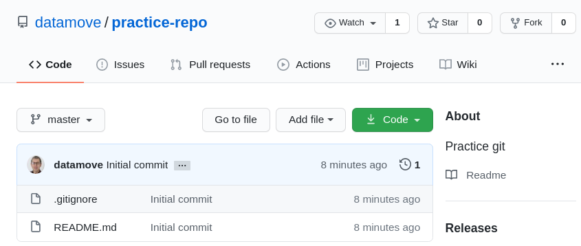
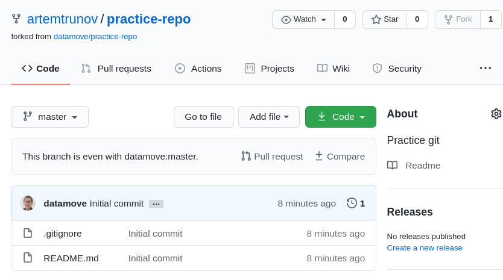
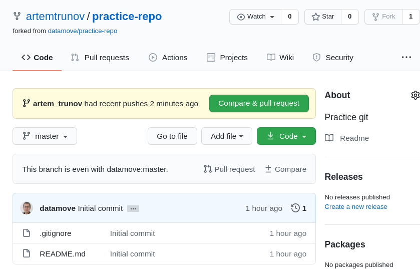
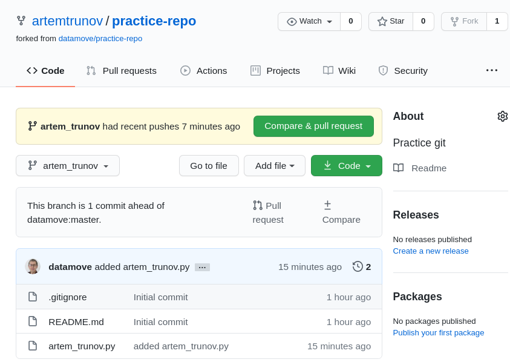
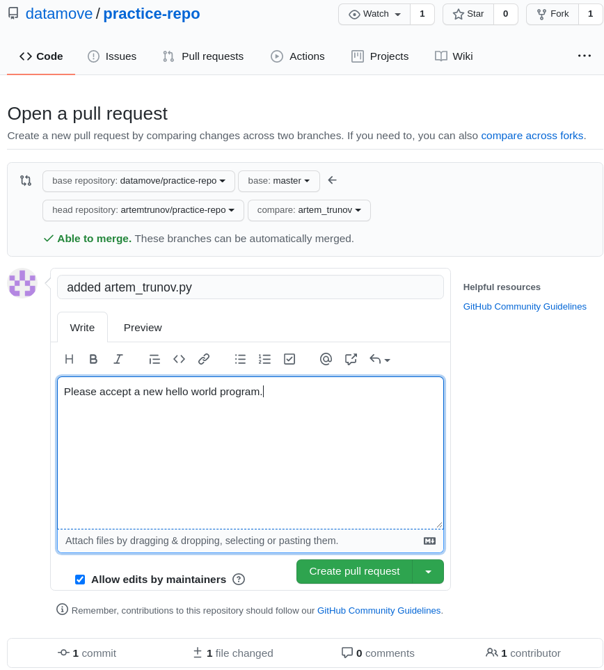
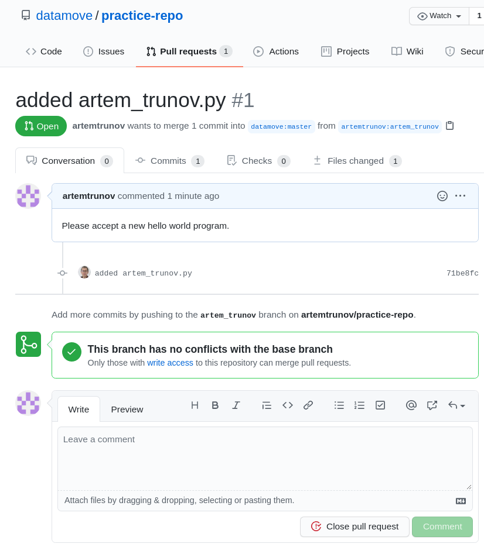
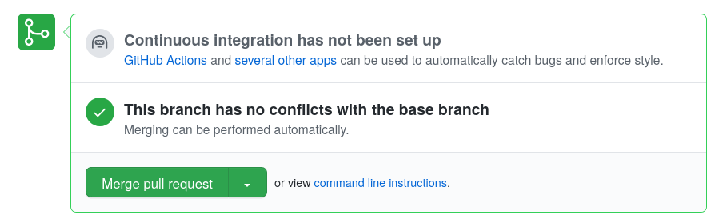
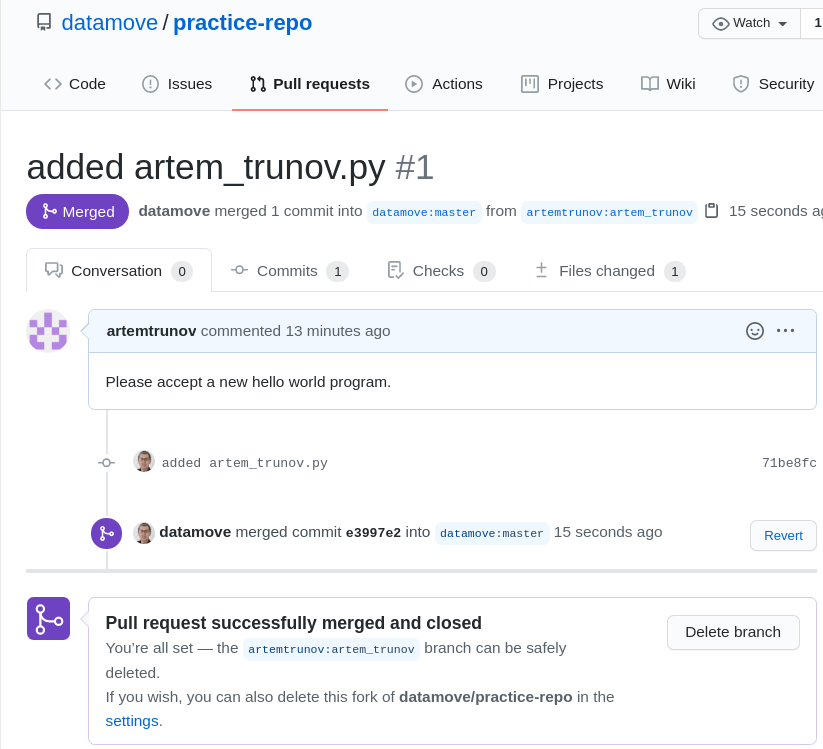

# How to contribute to someone else's repo.

В этом тьюториале девелопер (@artemtrunov) добавляет с помощью pull-request новый файл в публичный репо `datamove/practice-repo`, куда у него нет доступа на запись. 

## С высоты птичьего полета

* Форкаем чужой репозиторий
* Клонируем наш форк под персональным аккаунтом на сервере
* Создаем в нем новую ветку
* В этой ветке делаем изменения
* Фиксируем наши изменения (commit)
* Синхронизируем изменения в нашем форке на гитхабе (push)
* Делаем запрос на слияние ветки в нашем форке с мастер-веткой в оригинале (pull request).
* Синхронизируем локально изменения в чужом репозитории (pull)

## 1. Fork

Зайдите на страничку нужного вам репозитория и нажмите иконку Fork в правом верхнем углу:



Немного спустя репо с таким же названием появится под вашим аккаунтом:



## 2. Clone

Откройте окно терминала и клонируйте ваш форк (заменяйте artemrunov на ваш ник):

```
$ git clone git@github.com:artemtrunov/practice-repo.git
$ cd practice-repo
```

## 3. Branch

Создайте новую ветку и одновременно переключитесь на нее. В качестве названия выберите ваше имя.

```
$ git checkout -b artem_trunov
Switched to a new branch 'artem_trunov'
```

Убедимся, что ветка создана и мы на ней:

```
$ git branch
* artem_trunov
  master
```

## 4. Разработка

Создайте программу типа hello world на питоне с названием _ваше имя.py_

`echo 'print("Hello pull-request")' > artem_trunov.py`

Убедитесь, что она работает:

```
python3 artem_trunov.py 
Hello pull-request
```

## 5. Add, commit

Перед всеми "необратимыми" командами просматриваем статус:

```
$ git status
On branch artem_trunov
Untracked files:
  (use "git add <file>..." to include in what will be committed)

	artem_trunov.py

nothing added to commit but untracked files present (use "git add" to track)
```

Добавляем новый файл в репо:

```
$ git add artem_trunov.py
$ git commit -a -m "added artem_trunov.py"
[artem_trunov 71be8fc] added artem_trunov.py
 1 file changed, 1 insertion(+)
 create mode 100644 artem_trunov.py
```

## 6. Push

Теперь синхронизируем в свой форкнутый репо, как обычно:

```
$ git push 
fatal: The current branch artem_trunov has no upstream branch.
To push the current branch and set the remote as upstream, use

    git push --set-upstream origin artem_trunov
```

Что-то пошло не так...

Ошибка сама себя объясняет - мы же внесли изменения в новую ветку, а не main/master. У нас в репо нет еще этой новой ветки. Исправляется через указанием ветки в нашем удаленном репо:

```
$ git push -u origin artem_trunov
Username for 'https://github.com': artemtrunov
Password for 'https://artemtrunov@github.com': 
Counting objects: 3, done.
Delta compression using up to 6 threads.
Compressing objects: 100% (2/2), done.
Writing objects: 100% (3/3), 345 bytes | 345.00 KiB/s, done.
Total 3 (delta 0), reused 0 (delta 0)
remote: 
remote: Create a pull request for 'artem_trunov' on GitHub by visiting:
remote:      https://github.com/artemtrunov/practice-repo/pull/new/artem_trunov
remote: 
To https://github.com/artemtrunov/practice-repo.git
 * [new branch]      artem_trunov -> artem_trunov
Branch 'artem_trunov' set up to track remote branch 'artem_trunov' from 'origin'.
```

Давайте убедимся, что в удаленном репо на гитхабе (origin) появился новый файл.



Что-то его не видно, несмотря на уведомление "artem_trunov had recent pushes 2 minutes ago"...

Это потому, что мы смотрим ветку master. Переключаемся на ветку artem_trunov в левом верхнем углу.

Вот теперь все в порядке:



## 7. Pull Request

7.1 Замечаем строку над списком файлов:

**This branch is 1 commit ahead of datamove:master. Pull request ±Compare**

Нажав на ±Compare можно посмотреть список новых (по отношению к ветке мастер) коммитов и изменения в каждом коммите.

Убедившись, что это именно те изменения, которые мы хотим слить в ветку мастер, нажимаем **Pull-request** рядом с **±Compare**:



Обратите внимание:

* это pull-request в оригинальный репо datamove/practice-git
* слияние идет из ветки artem_trunov в master (но вы можете выбрать из какой ветки в какую)
* 'Able to merge' - нет конфликтов
* заголовок пул-реквеста идет из заголовка вашего коммита
* Добавьте описание пул-реквеста 
  * для других, чтоб им легче понять что и зачем вы сделали
  * для себя, чтоб легче вспоминать :)
* ниже поля формы для комментария - все коммиты этого пул-реквеста в деталях

7.2 Нажмите **Create Pull Request**.

7.3 Вот так он выглядит для вас и для остальных контрибьюторов. Вы можете оставить еще комментарий, можете закрыть ваш PR.



7.4 А у мейнтейнера добавляется еще одна секция для решения о слиянии:



7.5 После того как мейнтейнер утвердил PR:



Вы все еще можете оставить комментарии.

## 8. Обновление вашего форка 

После того, как ваши изменения в ветке artem_trunov вашего форка приняты в мастер оригинального репо, вам надо синхронизировать и мастер ветку вашего форка.

8.1 В той же папке вашего форка на сервере - переключаемся назад на ветку master.

```
$ git checkout master
```

8.2 Заметьте (команда ls), что ваш файл "исчез"! Это потому, что он пока существует только в ветке artem_trunov.

8.3 Чтобы нам синхронизировать изменения в мастере оригинального репо (upstream) с нашим форком с помощью команды pull, сначала региструем его в качестве remote:

```
$ git remote add upstream git@github.com:datamove/practice-repo.git
$ git remote -v
origin	git@github.com:artemtrunov/practice-repo.git (fetch)
origin	git@github.com:artemtrunov/practice-repo.git (push)
upstream	git@github.com:datamove/practice-repo.git (fetch)
upstream	git@github.com:datamove/practice-repo.git (push)
```

8.4. Это позволяет использовать алиас upstream в команде pull:

```
$ git pull upstream master
remote: Enumerating objects: 1, done.
remote: Counting objects: 100% (1/1), done.
remote: Total 1 (delta 0), reused 0 (delta 0), pack-reused 0
Unpacking objects: 100% (1/1), done.
From https://github.com/datamove/practice-repo
 * branch            master     -> FETCH_HEAD
 * [new branch]      master     -> upstream/master
Updating eab2bab..e3997e2
Fast-forward
 artem_trunov.py | 1 +
 1 file changed, 1 insertion(+)
 create mode 100644 artem_trunov.py
```

8.5 Убеждаемся, что новый файл теперь появился:

```
$ ls -al
total 24
drwxrwxr-x 3 artem artem 4096 Aug  7 14:08 .
drwxrwxr-x 3 artem artem 4096 Aug  7 12:25 ..
-rw-rw-r-- 1 artem artem   28 Aug  7 14:08 artem_trunov.py
drwxrwxr-x 8 artem artem 4096 Aug  7 14:08 .git
-rw-rw-r-- 1 artem artem 1799 Aug  7 12:25 .gitignore
-rw-rw-r-- 1 artem artem   30 Aug  7 12:25 README.md
```

8.6 И вообще, что все в порядке:

```
$ git status
On branch master
Your branch is ahead of 'origin/master' by 2 commits.
  (use "git push" to publish your local commits)

nothing to commit, working tree clean
```

8.7 Ой, не все в порядке. Надо еще синхронизовать локальную копию репо с репо на гитхабе (origin):

```
$ git push
Total 0 (delta 0), reused 0 (delta 0)
To git@github.com:artemtrunov/practice-repo.git
   eab2bab..e3997e2  master -> master
```

8.8 Вот теперь всё:

```
$ git status
On branch master
Your branch is up to date with 'origin/master'.

nothing to commit, working tree clean
```

## 9. Удаляем ветку разработки

9.1 Посмотрите на все веки, которые относятся к вашему репо, в том числе в удаленных репозиториях

`git branch -a`

напиминаю, что upstream - оригинальный репо, который вы форкнули, а origin - ваш форк на гитхабе

9.2 Удаляем ветку в локальном репо:

`git branch -d artemtrunov`

9.2 Удаляем ветку в origin:

`git push origin --delete artemtrunov`

9.3. Убеждаемся, что осталась только ветка master(main)

`git branch -a`


# Заметки

## Работа с бранчами

Создать, переключиться:

```
$ git branch artem_trunov
$ git checkout artem_trunov
```

Удалить:

```
$ git checkout master
$ git branch -d artem_trunov
```

## ИзменитьURL remote

```
git remote set-url $url
```

## push -u

После первой синхронизации в новую ветку можно будет снова не указывать -u


## Merging via command line

If you do not want to use the merge button or an automatic merge cannot be performed, you can perform a manual merge on the command line.

Step 1: From your project repository, check out a new branch and pull the changes.

```
git checkout -b "artemtrunov-artem_trunov" "master"
git pull https://github.com/artemtrunov/practice-repo.git "artem_trunov"
```

Step 2: Merge the changes and update on GitHub.

```
git checkout "master"
git merge --no-ff "artemtrunov-artem_trunov"
git push origin "master"
```

