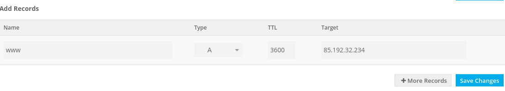

# domain-certificate-nginx

This is a tutorial on how to get a free domain, free SSL certificate and setup an nginx server proxy for SSL termination.

# Получить доменное имя (в том числе бесплатно)

Зайдите на сайт freenom.com и зарегистрируйтесь (можно использовать Google или Facebook Oauth login). После логина на сайт зайдите в Services→Register a New Domain. Введите желаемое доменное имя в строку поиска. Несколько доменов верхнего уровня можно зарегистрировать бесплатно!


Однако доступность обманчива – кликните "Get it now!" И можете получить "Not available" в ответ. Этот сайт так же может выдать "Not available" если вы не вошли на сайт. Видимо, это предохранение от ботов.

Можете заранее посмотреть, свободно ли выбранное вами имя с помощью утилиты `whois`:

```
$ whois hse2020.ml
Invalid query or domain name not known in Point ML Domain Registry
```


Итак, если ваше имя доступно, оно будет отмечено Selected и вы можете идти на Checkout.


Обратите внимание на Period, который по умолчанию 3 месяца, после которых вам придется платить, чтобы сохранить контроль над доменом. Можно выбрать бесплатное использование до 12 месячев включительно.

Теперь вы можете нажать Continue, либо сразу настроить DNS.

# Привязать домен к имеющемуся IP-адресу

## В момент приобретения

Нажмите "Use DNS" и затем выберите вкладку "Use Freenom DNS Service". Откроется форма "Enter your A-record here". A-record – это статический IP-адрес сайта. Freenom дает вам возможность бесплатно записать два A-record – на ваш главный домен и его поддомен, либо на два поддомена. По умолчанию, в форме уже введены домен и поддомен www. В большинстве случаев, вы так и оставите их. Если у вас два хоста и два статических IP-адреса, то вы можете этим воспользоваться и назначить разные адреса обоим А-записям. А если у вас только один хост и один IP-адрес, то введите его.


Жмите Continue. Если обнаружите "Your Shopping Cart is Empty" - вы где-то замешкались и корзина очистилась. Начинайте сначала. Если все ок, то можно завершить заказ.


## После приобретения

Если вы не завели никаких DNS records в процессе заказа, то можете это сделать в любой момент после приобретения домена. Зайдите в меню Services→Му Domains. Нажмите Manage Domain в строчке с вашим доменом, и на следующей странице - Manage Freenom DNS. Тут вы можете добавить записи DNS. По умолчанию уже стоит тип A-record. Оставьте поле Name пустым для основного домена, или введите имя поддомена, например www. В поле Target укажите внешний IP-адрес вашего хоста. Нажмите Save Changes. 



### Проверка

Зайдите по ssh на ваш сервер и сделайте пинг по имени домена:

```
artem@artem-ubuntu2:~$ ping hse-execute-startup.ml
PING hse-execute-startup.ml (85.192.32.234) 56(84) bytes of data.
```

Впрочем, можно это сделать и не с вашего сервера, и он даже не должен быть запущен. Утилита ping в любом случае выведет имя и адрес, если запись DNS уже работает. Может и не работать, тогда подождите, так как обновление DNS может занять некоторое время. Или проверьте, правильное ли имя вы пингуете.

# Получить сертификат

Теперь можно получить сертификат SSL для вашего сервера. Важно понимать, что она дается на имя, привязанное к IP-адресу. Сертификат получается именно на том сервере, на который указывает A-record.

Перед тем как выполнять эту часть, убедитесь, что у вас:

* установлен docker
* открыт наружу порт 80 вашего хоста, и ваш веб-сервер, если использует этот порт, не запущен.

Первое условие проверяется командой:

```
$ docker run --rm hello-world
```

а второе:

```
$ curl hse-execute-startup.ml
curl: (7) Failed to connect to hse-execute-startup.ml port 80: Connection refused
```

если запустить эту команду с лаптопа или другого сервера. Вы должны получить сообщение Connection Refused, которое означает, что порт 80 открыт и на нем никакое приложение не откликается. Если ваша команда зависает - посмотрите настройки облачного файрвола, а если получен отклик, то остановите веб-сервер, использующий этот порт.

Загрузите образ сертбота:

```
$ docker pull certbot/certbot
```

Запустите, подставив ваше доменное имя в опцию -d и ответив на вопросы (email нужен, чтобы прислать вам напоминание о необходимости обновить сертификат):

```
$ sudo docker run -it --rm --name certbot -v "/etc/letsencrypt:/etc/letsencrypt" -v "/var/lib/letsencrypt:/var/lib/letsencrypt" certbot/certbot certonly --standalone -d hse-execute-startup.ml
Saving debug log to /var/log/letsencrypt/letsencrypt.log
Plugins selected: Authenticator standalone, Installer None
Enter email address (used for urgent renewal and security notices) (Enter 'c' to
cancel): мойимейл@gmail.com

- - - - - - - - - - - - - - - - - - - - - - - - - - - - - - - - - - - - - - - -
Please read the Terms of Service at
https://letsencrypt.org/documents/LE-SA-v1.2-November-15-2017.pdf. You must
agree in order to register with the ACME server at
https://acme-v02.api.letsencrypt.org/directory
- - - - - - - - - - - - - - - - - - - - - - - - - - - - - - - - - - - - - - - -
(A)gree/(C)ancel: A

- - - - - - - - - - - - - - - - - - - - - - - - - - - - - - - - - - - - - - - -
Would you be willing to share your email address with the Electronic Frontier
Foundation, a founding partner of the Let's Encrypt project and the non-profit
organization that develops Certbot? We'd like to send you email about our work
encrypting the web, EFF news, campaigns, and ways to support digital freedom.
- - - - - - - - - - - - - - - - - - - - - - - - - - - - - - - - - - - - - - - -
(Y)es/(N)o: Y
Obtaining a new certificate
Performing the following challenges:
http-01 challenge for hse-execute-startup.ml
Waiting for verification…
Cleaning up challenges

IMPORTANT NOTES:
 - Congratulations! Your certificate and chain have been saved at:
   /etc/letsencrypt/live/hse-execute-startup.ml/fullchain.pem
   Your key file has been saved at:
   /etc/letsencrypt/live/hse-execute-startup.ml/privkey.pem
   Your cert will expire on 2020-04-22. To obtain a new or tweaked
   version of this certificate in the future, simply run certbot
   again. To non-interactively renew *all* of your certificates, run
   "certbot renew"
 - If you like Certbot, please consider supporting our work by:

   Donating to ISRG / Let's Encrypt:   https://letsencrypt.org/donate
   Donating to EFF:                    https://eff.org/donate-le
```

Убедитесь, что сгенерированные ключи действительно присутствуют:

```
sudo ls -al /etc/letsencrypt/live/hse-execute-startup.ml/
```

Рекомендуется заархивировать и сохранить копию ключей (лучше даже всю папку `/etc/letsencrypt/`).

Так же обратите внимание на срок действия сертификата. Он составляет 3 месяца, и его надо заранее обновить. В качестве домашнего задания установите cron-задачу на периодическое обновление сертификата.

# Установить nginx

```
$ docker pull nginx
```

Теперь надо сделать выбор. Ниже показано две конфигурации, полезные в разных условиях.

Первая - nginx запущен в контейнере, а приложение нативно на сервере, не в контейнере. Это удобно для начального этапа разработки - вы просто редактируете код и запускаете ваш сервер, не дожидаясь сборки контейнера.

Вторая - и nginx, и ваш веб-сервер запущены каждый в своем контейнере, и эти контейнеры управляются docker-compose. Такая конфигурация подходит для промышленного использования, и более безопасна.

## Случай приложения на хосте

Для начала запустите команду:

```
ip a
```

и заметьте адрес интерфейса docker0. По этому адресу мы сможем “выйти” из контейнера и обратиться к сервисам на хосте. В нашем случае этот адрес `172.17.0.1`.

### Конфигурация nginx

Поместите нижеследующий конфиг в файл `nginx.conf` (в нашем случае в `/home/ubuntu/nginx.conf`)

[app-on-host/nginx.conf](app-on-host/nginx.conf)


В этой конфигурации в секции `stream` терминируем ssl соединения на порту 443 и перенаправляем незашифрованный трафик на порт 8080 хоста. Мы передаем путь к сертификату и ключу в соответствующих опциях.

Далее, в секции `http` мы отсылаем http-клиенту код перенаправления его нешифрованного запроса (протокол http, порт 80) на шифрованный (протокол https, порт 443).

### Запуск

```
$ docker run --name nginx-ssl --rm  -v /etc/letsencrypt:/etc/letsencrypt:ro -v /home/ubuntu/nginx.conf:/etc/nginx/nginx.conf:ro -p 443:443 -p 80:80 nginx
```

Запускаем контейнер под именем nginx-ssl c опциями:

* самоудалиться после останова,
* проброса папки с сертификатами (readonly),
* проброса конфиг-файла nginx (readonly),
* проброса портов 443 и 80


### Проверка

Запустите ваш веб сервер на порту 8080 и выполните следующие команды на удаленной машине:

```
curl -k https://hse-execute-startup.ml
curl -k -L http://hse-execute-startup.ml
```

В первой команде мы тестируем https и даем опцию -k для нестрогой проверки сертификатов, так как у нас нет в наличие корневых сертификатов для CA, которая выдала сертификат для нашего сайта (если есть, то их можно указать аргументом опции --cacert вместо -k).

Во второй команде мы используем http и инструктируем curl следовать адресу перенаправления (сервер выдаст код 301 и адрес https:// см. объяснение конфига nginx выше).

В обоих случаях вы должны получить обычный ответ от вашего сервера.

## Конфиг для приложения в контейнере

### docker-compose

Воспользуемся docker-compose для запуска двух контейнеров с общей сетью. Официальная документация предлагает установить docker-compose следующим образом:

```
$ sudo curl -L "https://github.com/docker/compose/releases/download/1.25.1/docker-compose-$(uname -s)-$(uname -m)" -o /usr/local/bin/docker-compose
$ sudo chmod +x /usr/local/bin/docker-compose
```

### Конфигурация docker-compose

Создайте новую папку, например docker-ssl, создайте файл `docker-compose.yml` и поместите туда следущую конфигурацию:

[app-in-docker/docker-compose.yml](app-in-docker/docker-compose.yml)

Здесь определяется два сервиса:

* nginx, с опциями проброса портов и файлов,
* webservice, который суть nginx из того же образа, но с конфигом по умолчанию - он будет выдавать welcome-page на порту 80.

Мы так сделали для простоты  чтобы проиллюстрировать подход. Вы, конечно, будете запускать свой веб-сервер.

### Конфигурация nginx

Конфигурация nginx будет отличаться адресом в опции `proxy_pass`. Замените 

`proxy_pass 172.17.0.1:8080;`

на 

`proxy_pass webservice:80;`

Дело в том, что docker-compose создает новую приватную сеть для контейнеров, и внутри нее к контейнерам можно обращаться по именам их сервисов.

## Запуск

Зайдите в директорию docker-ssl и запустите:

```
$ docker-compose up
Starting docker-ssl_nginx_1      ... done
Starting docker-ssl_webservice_1 ... done
Attaching to docker-ssl_nginx_1, docker-ssl_webservice_1
```

## Проверка

Запустите те же самые команды, но теперь они дожны выдавать страничку “Welcome to nginx!”.

В окне с запущеным docker-compose будут выводиться логи с обоих контейнеров, пока вы не нажмете Сtlr-C для останова:

```
webservice_1  | 172.18.0.2 - - [23/Jan/2020:14:37:23 +0000] "GET / HTTP/1.1" 200 612 "-" "curl/7.58.0" "-"
nginx_1       | 84.23.42.150 - - [23/Jan/2020:14:37:27 +0000] "GET / HTTP/1.1" 301 169 "-" "curl/7.58.0"
webservice_1  | 172.18.0.2 - - [23/Jan/2020:14:37:27 +0000] "GET / HTTP/1.1" 200 612 "-" "curl/7.58.0" "-"
^CGracefully stopping... (press Ctrl+C again to force)
Stopping docker-ssl_nginx_1      ... done
Stopping docker-ssl_webservice_1 ... done
```


# Links

* https://docs.nginx.com/nginx/admin-guide/security-controls/terminating-ssl-tcp/


